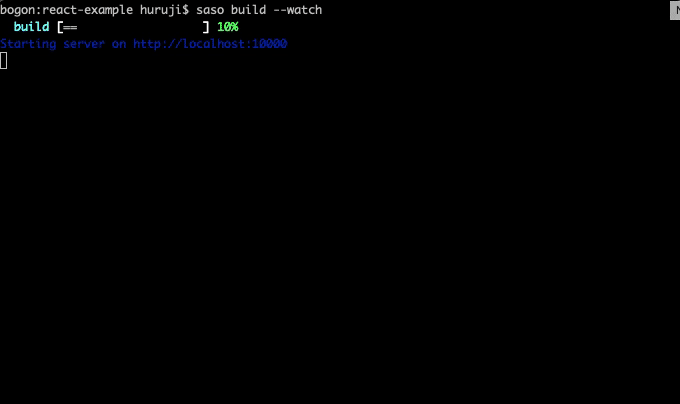

<p align="center">

</p>

# saso
一个**零配置**、**渐进式**的 web 打包工具，既能让你**更加无痛**的维护旧的 web 应用，也能让你**更快开发现代化**的 web 应用。

## 为什么使用 `saso`

当前的 web 开发人员几乎离不开 webpack，每次新项目的搭建都花费了大量的时间去配置 webpack 和配置相应的lint、test等环境，这些周边工作本应是一键完成的。

同时我们回忆一下，我们昨天维护的老旧的 web 应用，是否想要搭建环境花费了你太多时间呢？

以上的这些问题 saso 都可以一键帮你解决。


## `saso` 的理念

`saso` 推崇入口文件为 `.html` 文件，这样更加符合早期的学习理念，也就是说最早你是怎样写 web 应用的，使用 `saso` 你就可以返回 `.html` 文件链接 `.css` 和 `.js` 文件的时代。

在你的项目中，你不需要配置和安装 `webpack` 、 `stylus` 、 `babel` 等任何配置项，假设你的项目只有`.html`文件，你只要运行一下 `saso` 就可以帮你快速打包
```
└───index.html
└───index.css
└───main.js
```

<p align="center">

</p>

## 快速开始

```bash
npm i saso -g
```

切换到你的项目中

```bash
saso build --watch
```

## 内置的 command

### `saso build`

编译打包项目。

这个命令有以下 `options` :

**`-w  --watch`** : 开启 `watch` 模式

**`-d  --dev  --development`** : 使用 `development` 模式

**`-p  --prod  --production`** : 使用 `production` 模式

**`--webpack  --webpackconfig`** : 编译时输出相应的 `webpack` 配置信息

**`-a  --analyzer`** : 使用 `[webpack-bundle-analyzer](https://github.com/webpack-contrib/webpack-bundle-analyzer)` 分析 `bundle`

**`--config <configFile>`** : 通过命令行指定 `saso` 的配置文件

**`--entry <entryFile>`** : 通过命令行指定打包的入口文件

**`--port <port>`** : 通过命令行指定端口，指定了 `port` 时，则必定开启监听模式

## 编写 `saso` 配置文件

saso 的配置文件和其他开源工具一样，支持在 `package.json` 中的属性定义，也支持 rc 文件、`.json` 、`.yaml`、`.yml`、`.js`文件，如可以在项目的文件夹中使用名为 `saso.config.js` 文件配置 `saso`

```js
module.exports = {
  watch: true,
  port: 9000
}
```

### `saso` 的配置项

+ **analyzer**

Type: `Boolean` `Object`

[webpack-bundle-analyzer](https://github.com/webpack-contrib/webpack-bundle-analyzer) 的配置 `options`，默认不开启 `webpack-bundle-analyzer` 这个插件，当这个配置有值的时候，则开启。


+ **authorInfo**

Type: `Boolean` `Object`

[author-webpack-plugin](https://github.com/huruji/author-webpack-plugin) 的配置`options`，如果为 `Boolean` 值 `true` 则从最近的 `package.json` 中获取作者信息，如果为 `Boolean` 值 `false` 则不使用 [author-webpack-plugin](https://github.com/huruji/author-webpack-plugin) 插件。


+ **cliPlugins**

Type: `Array`


+ **entry**

Type: `String`

项目的入口文件，可以是 `.js` 、`.html` 文件，当入口是 `.html` 文件的时候，`saso` 会解析这个 `.html` 文件依赖的文件，因此推荐使用这种方式，这也更加符合前端开发者的思维。

如果不指定 `entry` 时，`saso` 会依次寻找以下文件作为入口文件 `index.html`、 `src/index.html`、`index.js`、`main.js`、`src/index.js`、 `src/main.js`。


+ **mode**

Type: `String`

Default: `development`


+ **plugins**

Type: `Array`


+ **polyfillService**

Type: `Boolean` `String`

Default: `false`

[polyfill-service](https://github.com/Financial-Times/polyfill-service) 的链接，当为 `Boolean` 值 true 的时候，默认使用国内阿里的CDN `//polyfill.alicdn.com/polyfill.min.js` 。


+ **port**

Type: `Number`

Default: `1000`


## Hooks

`saso` 内部的工作原理是依赖于 **钩子(Hooks)** 的，在如今前端大繁荣的情况下，`saso` 不可能能够满足所有的情况，当你需要自定义 `saso` 时，那么这些 `Hooks` 将非常有用。

### afterConfigure

处理完 `saso` 配置后触发

**params:** `config`

### afterConfigureAsync

`afterConfigure` Async 版本

**params:** `config`

### beforeCompile

webpack 编译前触发

**params:** `webpackChain` 一个 [webpack-chain](https://github.com/neutrinojs/webpack-chain) 实例

### beforeCompileAsync

`beforeCompile` Async 版本

**params:** `webpackChain`


## plugins

`saso` 的 `plugin` 分为 `cli` 的 `plugin` 和普通的 `plugin`。

`cli` 的 `plugin` 是为了拓展 `saso` 的命令，这在使用 `saso` 来拓展功能以符合团队需求时非常有用，如：你的团队想要通过 `saso releaseCDN` 这个命令来将你的静态资源一键发布到 CDN，这个需求便可以通过编写 `saso` 的 `cli` 命令来实现。

`saso` 的普通 `plugin` 通常是为了拓展 `saso` 的 `webpack` 配置，当然它还可以做很多其他的事情。

如果你熟悉 `webpack` 的 `plugin` 编写，`saso` 的 `plugin` 设计受到了 `webpack` 的启发，因此你能够快速编写你的 `plugin`。

接下来就是编写一个 `cli` `plugin` 和普通 `plugin` 的实例

**TODO**

